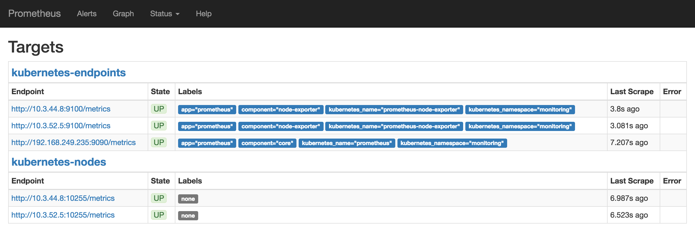
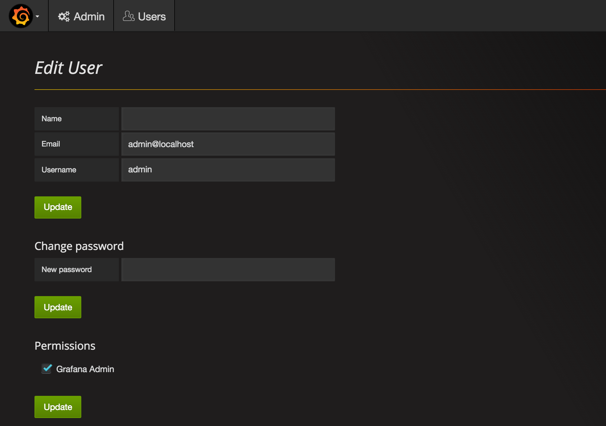
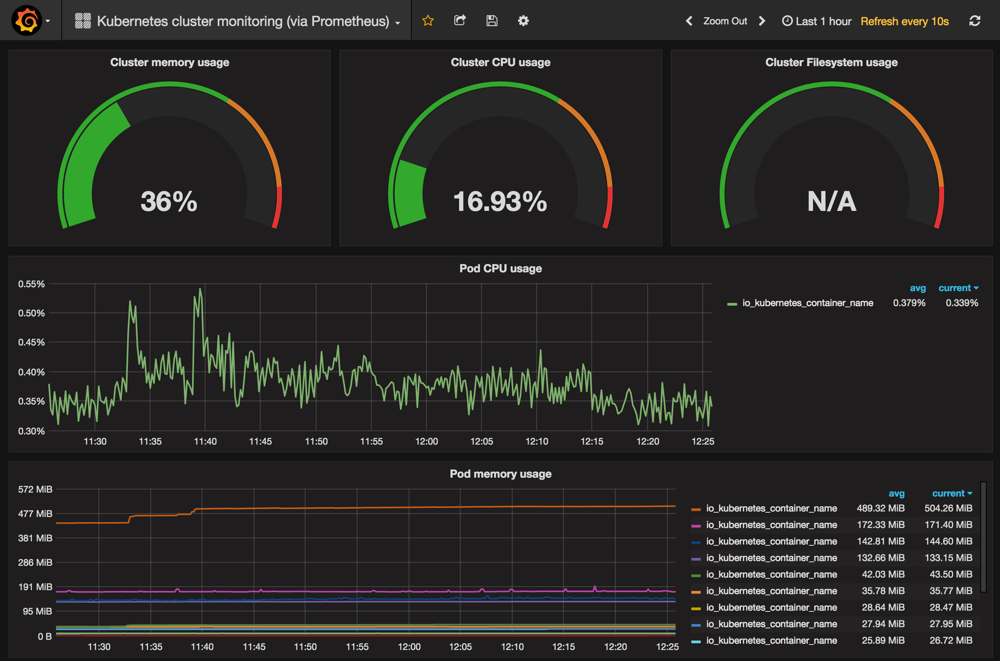

+++
title = "Monitoring with Prometheus and Grafana"
description = "Recipe to spin up a monitoring setup with Prometheus and Grafana on Kubernetes."
date = "2016-10-14"
type = "page"
weight = 100
categories = ["recipes"]
+++

# Monitoring with Prometheus and Grafana

[Prometheus](https://prometheus.io/) is an open-source monitoring solution that includes the gathering of metrics, their storage in an internal time series database as well as querying and alerting based on that data.

It offers a lot of integrations incl. Docker, Kubernetes, etc.

Prometheus can also visualize your data. However, in this recipe we include another open-source tool, [Grafana](http://grafana.org/), for the visualization part, as it offers a more powerful and flexible way to generate visuals and dashboards.

## Deploying Prometheus and Grafana

The following command will set you up with all neccesary components and some first dashboards to check out.

```bash
kubectl apply --filename https://raw.githubusercontent.com/giantswarm/kubernetes-prometheus/master/manifests-all.yaml
```

## Checking Prometheus

Wait a bit for all the pods to come up. Then Prometheus should be ready and running. We can check the Prometheus targets at https://api.<cluster-id>.k8s.gigantic.io/api/v1/proxy/namespaces/default/services/prometheus:9090/targets



*Note*: The above URL uses your Kubernetes API to proxy to the service. As the API is guarded with your credentials, you need to [set them up in your system](/guides/accessing-services-from-the-outside/) (and/or browser). We do not recommend to set up an Ingress for Prometheus at this time, as it currently does not support any kind of authentification and thus your cluster would be open to everyone.

## Checking Grafana

Now that we know Prometheus is up and running we can check for Grafana.

There's an ingress set up for Grafana, so it should be available at https://http://grafana.monitoring.<cluster-id>.k8s.gigantic.io/

You can user the default admin (`admin:admin`) user for your first login. You should this admin user to reflect your desired username, your email, and a secure password ASAP!

## Changing the admin

You can change the default admin user at http://grafana.monitoring.<cluster-id>.k8s.gigantic.io/admin/users/edit/1



Please note, that you need to update the Password and the user data (username, email, etc.) separately with the respective update buttons below each section.

## Check out your dashboards

You can now checkout the included dashboards, e.g. the [Cluster Monitoring Overview](http://grafana.monitoring.l8.k8s.gigantic.io/dashboard/db/kubernetes-cluster-monitoring-via-prometheus).



## Next Steps

Next, you should get into the [Grafana](http://docs.grafana.org/) and [Prometheus](https://prometheus.io/docs/introduction/overview/) documentations to get to know the tools and either build your own dashboards or extend the samples from above.

You can also check out grafana.net for some more example [dashboards](https://grafana.net/dashboards) and [plugins](https://grafana.net/plugins).

You might also want to set up some [alerting](https://prometheus.io/docs/alerting/overview/).
